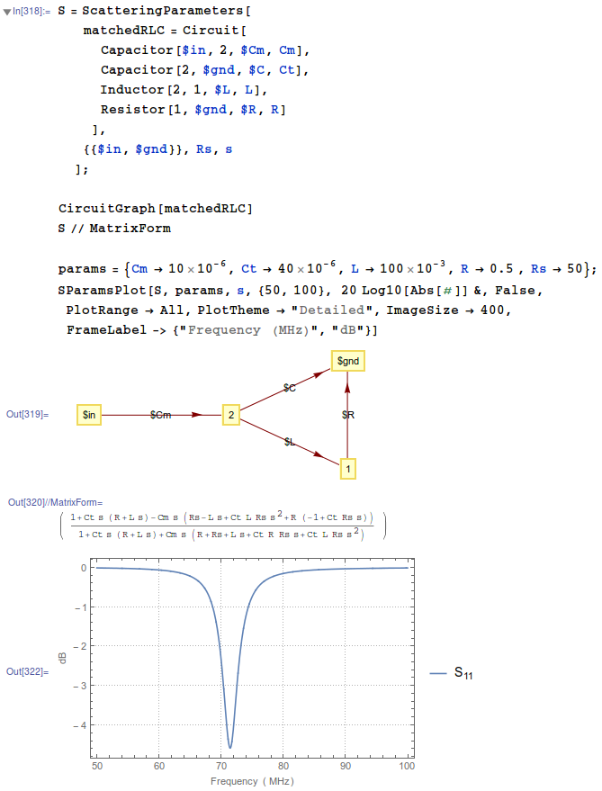

# circuit-modeler
Tools for working with lumped element electrical circuits in *Mathematica*.

## Requirements and Installation

 - Tested with *Mathematica* 10.0.2. Should work with *Mathematica* 9 and higher, but is untested.
 - Open the notebook `Install.nb` and follow the directions there.

## Features

This library is in many ways still very basic; it was an overkill project to spare some non-electrical-engineers from having to do some easy calculations by hand. Still, it is very useful if you want to do any of the following easily and symbolically:

 - Express circuits as abitrary graphs of lumped elements, much like in SPICE, however, component values can be symbolic.
 - Apply Kirchoff's laws to circuit graphs to get circuit equations in time or Laplace domain.
 - Compute S (scattering), X, or Y matrices of circuits with an arbitrary number of ports. Compute ABCD matrix for two-port devices.
 - Visualize circuit graphs, plot S-parameters, etc.
 - 
 
## Example

The following example computes and plots the S11 parameter of a matched RLC circuit.

## License

You are free to use this software, with or without modification, provided that the conditions listed in the LICENSE.txt file are satisfied.
